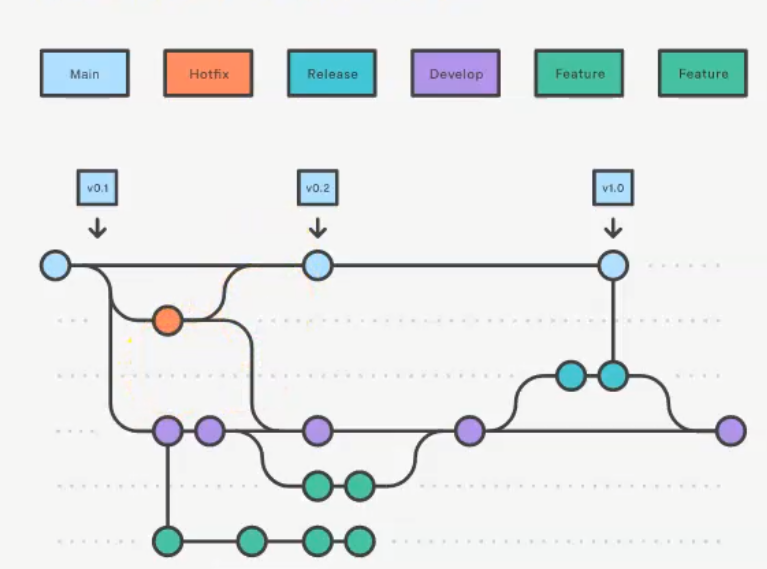

# Prueba-GitFlow
Git Flow es una metodología diseñada para trabajar de forma colaborativa proyectos de Git Hub. Consiste en establecer
una serie de ramas por defecto que permiten tener una estructura de proyecto similar y organizada entre todos los 
colaboradores del proyecto para trabajar de forma organizada en un desarrollo

## Ramas predefinidas

Existen dos ramas principales: `main` y `develop`. La rama `main` es la que se sube a produccion, la que va a ver el
cliente y donde se mostrarán versiones estables y sin errores de la aplicación. La rama `develop` es en la que se 
implementaran mejoras y cambios a las versiones. A partir de `develop` se crean ramas `feature` que sirven para trabajar 
en el desarrollo, en las cuales se trabajará distintas partes del proyecto y donde trabajará cada integrante del 
proyecto, lo cual facilitará que cada uno se centre en su parte del proyecto sin afectar a los demás. Al acabar, los 
cambios y méjoras se unifican en la rama `develop`. La rama `release`, parte de `develop` y sirve para realizar pruebas 
unitarias de los cambios y mejoras del proyecto. Si se descubre algún error o fallo en los cambios realizados se vuelve 
a trabajar en la rama `develop` y se vuelven a realizar pruebas unitarias, en caso de que se superen las pruebas se 
suben los cambios `main` y se crea una nueva version. La rama `hotfix` parte de `main` y se crea cuando surge un error 
imprevisto en producción. Cuando ocurre el error, se crea la rama `hotfix`, se arregla el error, y se suben la nueva 
version estable a `main`.

- Main: Rama principal donde se encuentran las versiones estables del proyecto
- Develop: Rama donde se encuentra el proyecto en desarrollo
- Feature: Rama donde se trabaja en una parte del proyecto
- Release: Rama donde se realizan pruebas unitarias de los cambios y mejoras
- Hotfix: Rama donde se solucionan fallos imprevistos de las versiones estables

